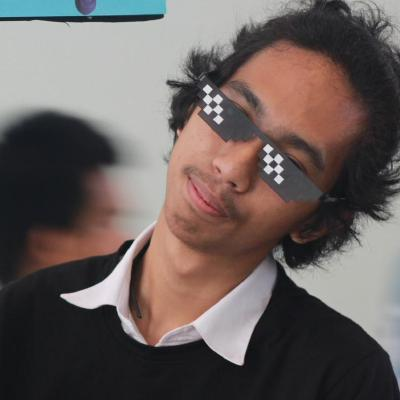
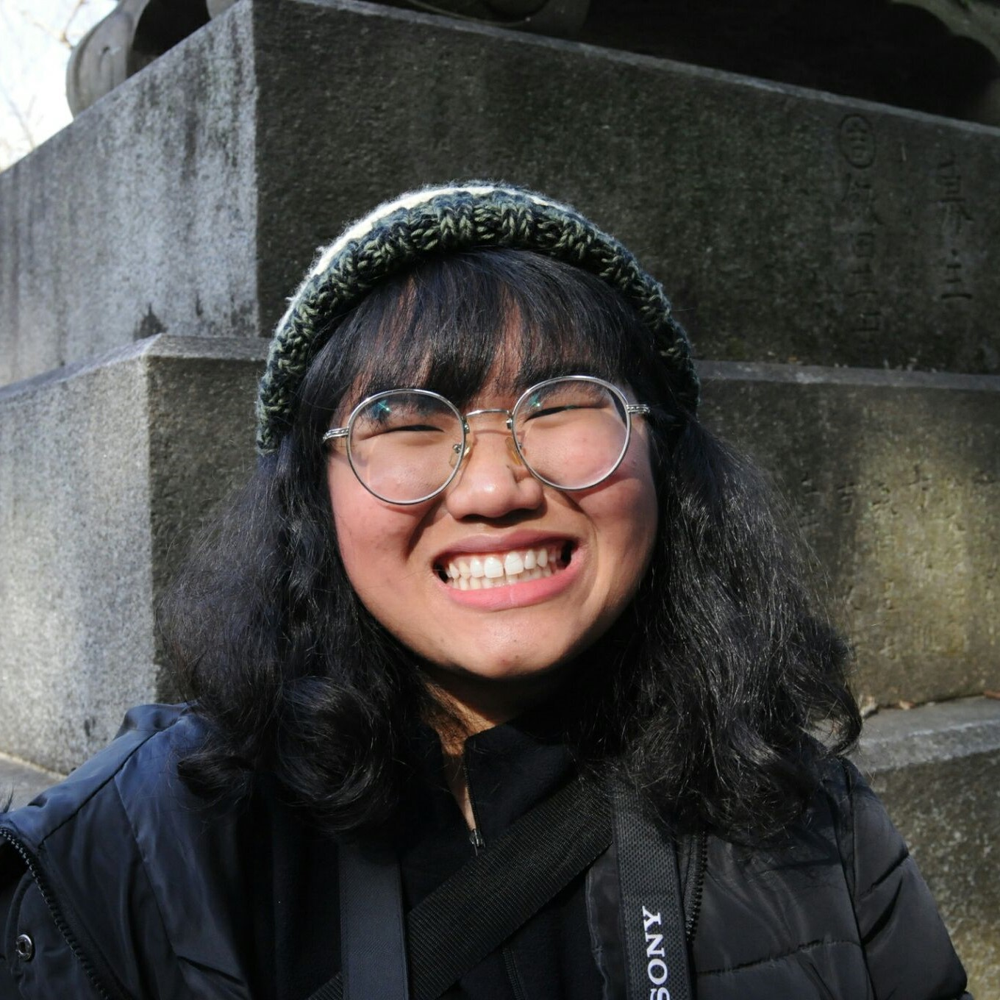

# The-Duke
##สิ่งที่ต้องทำ (คิดว่าขาดอะไรก็เติมได้อีก)  
- [x] ทำหน้าGUI 
- [x] เขียนฟังก์ชั่นที่ใช้ในเกม 
- [ ] เเยกเป็น head file ก็จะดีมาก ไม่งั้น ทุกอย่างจะอยู่เเค่ ไฟล์เดียว 
- [ ] ใส่รายละเอียดตัวละคร 

# C Game Mini-Project
## The-Duke
This Project is a part of course __06016315 Computer Programming__ (Academic Year 2018), Faculty of Information Technology, King Mongkut's Institute of Technology Ladkrabang.

# Team Member
|  |  |  |  |
|-----------------------------------------------------|------------------------------------------------------|-----------------------------------------------------|------------------------------------------------------|
| __61070004__ - Krittima Chantachalee                | __61070016__ - Kittiwat Boonpean                 | __61070059__ - Nichapat Kachacheewa                         | __61070200__ - Woramat Ngamkham                     |

