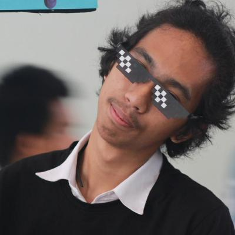

# C Game Mini-Project
## The-Duke
โปรเจคนี้เป็นส่วนหนึ่งของวิชา __06016315 Computer Programming__ (ปีการศึกษา 2561) คณะเทคโนโลยีสารสนเทศ สถาบันเทคโนโลยีพระจอมเกล้าเจ้าคุณทหารลาดกระบัง

# รายละเอียด
## เกี่ยวกับเกม
__The-Duke__ เป็นเกมแนว Abstract strategy game โดยใช้ผู้เล่น 2 คน รูปแบบเกมจะคล้ายหมากรุกโดยที่ผู้เล่นแต่ละคนจะผลัดตากันเดิน สามารถเดินไปกินหมากอีกฝ่ายได้ และสามารถเรียกหมากของเรามาเพิ่มในกระดานได้ ในเกมจะมีหมากที่ซื่อว่า Duke ที่เปรียบเสมือนตัวขุนนางในหมากรุก __หากฝ่ายใดสามารถจับ   Duke ของอีกฝั่งได้ จะเป็นฝ่ายชนะทันที__

## วิธีการเล่น
1. เลือกวาง Duke ไว้ที่หนึ่งในสองตำแหน่งตรงกลางขอบตารางฝั่งของตนเอง
2. เลือกวาง Footmen x 2 ประกบด้านข้างคอยอารักขา โดย Footmen จะต้องมีมุมที่ติดกับ Duke อย่างน้อยสองมุม หรือก็คือด้านบนและด้านข้างเท่านั้น
3. สลับกันเดินเหมือนหมากรุกจนกว่าจะมีผู้ได้รับชัยชนะ (สามารถจับ Duke ของฝั่งตรงข้ามได้)
4. ในแต่ละเทิร์นผู้เล่นต้องเลือกทำ 1 อย่างจากทั้งหมด 3 อย่าง
   * ขยับหมาก ได้ตามที่กำหนดไว้บนหมาก
   * วางหมาก  สุ่มหมากจากในเกม 1 ชิ้นแล้วก็วางไว้ด้านบนหรือด้านข้างของ Duke
   * ใช้ความสามารถของหมาก (กฎพิเศษในหมากบางตัว)

# Team Member
|  |  |  |  |
|-----------------------------------------------------|------------------------------------------------------|-----------------------------------------------------|------------------------------------------------------|
| __61070004__ - Krittima Chantachalee                | __61070016__ - Kittiwat Boonpean                 | __61070059__ - Nichapat Kachacheewa                         | __61070200__ - Woramat Ngamkham                     |

# Assistant Teacher
|  |  |
|:-:|:-:|
|ผศ. ดร. กิติ์สุชาต พสุภา|ผศ. ดร. ปานวิทย์ ธุวะนุติ|